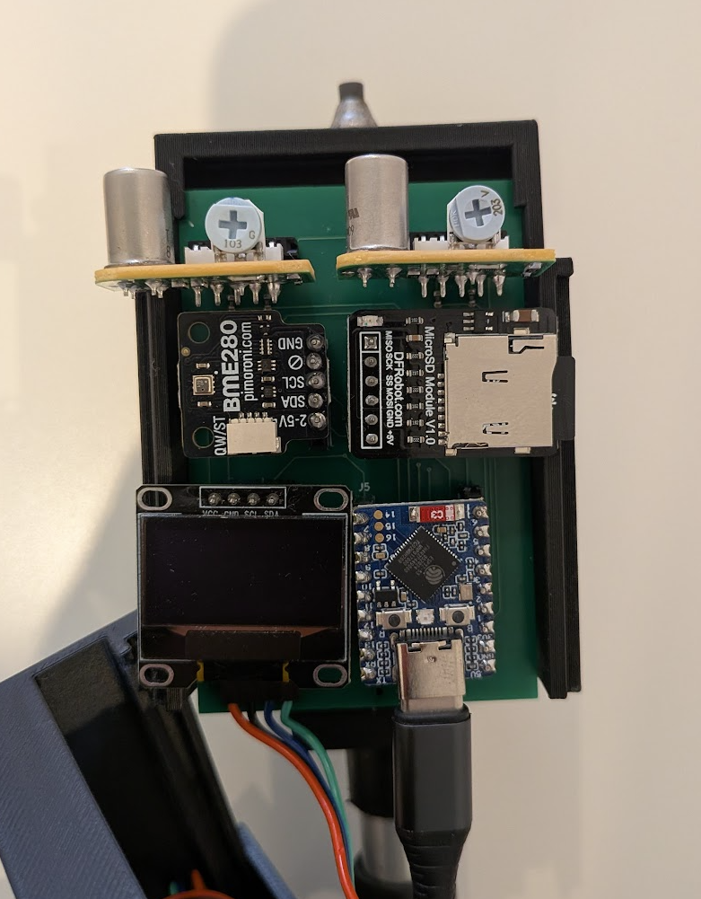
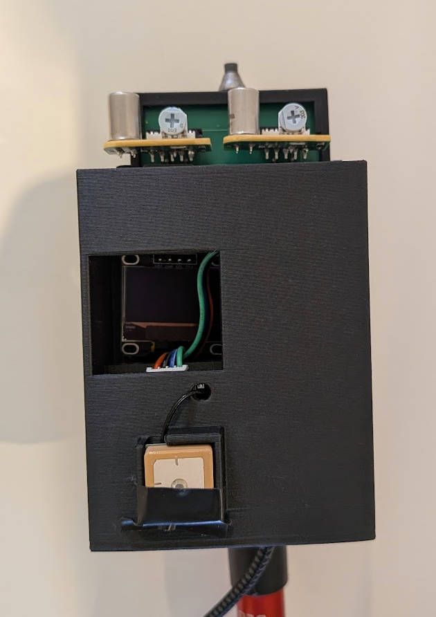

# Atmospheric methane detector

A handheld, GPS-tagged instrument for detecting atmospheric methane on walking
surveys. Two Figaro metal-oxide sensors, a GNSS receiver and a BME280 log a
geotagged CSV to a microSD card; Python tools turn that log into maps and videos.
The longer-term aim is fossil-vs-biogenic source discrimination from the two
channels. This is a citizen-science build, not a product — the firmware logs
exactly what the hardware reported, uncorrected.

<p align="center">
  
  
</p>

<p align="center"><em>The rev-A prototype — the carrier board (left) and the same build in its hand-held enclosure (right).</em></p>

## Status

The firmware is working: it reads both gas channels, the OLED, the GNSS and the
BME280, runs a rolling-percentile baseline and a HIGH/MED/LOW classifier, drives
the onboard RGB status LED, and logs one geotagged row per sample to microSD (and
serial). The BOOT button re-zeros the baseline. NVS storage and a dedicated mark
button are not done yet. The full design notes are in the header comment of
[src/main.cpp](src/main.cpp).

**Known limitation:** the DFRobot GNSS library (I2C mode) gives satellite count,
position, altitude and UTC, but **not** HDOP or fix type, so the firmware derives
a coarse FIX / NO-FIX from satellite count and plausible coordinates. Real fix
quality would need the module's UART NMEA stream.

## Hardware

Target board: **Waveshare ESP32-S3-Zero** (ESP32-S3FH4R2 — 4 MB flash, 2 MB
PSRAM, native USB). It has no official PlatformIO definition, so the build uses
`esp32-s3-devkitc-1` with flash pinned to 4 MB.

| Peripheral | Part | Interface | Power |
|---|---|---|---|
| OLED display | SSD1306 128x64 | I2C (0x3C) | 3V3 |
| Methane sensor | Figaro NGM2611-E13 | analog VOUT → ADC | 5V |
| LP-gas sensor | Figaro LPM2610-D09 | analog VOUT → ADC | 5V |
| GNSS | DFRobot Gravity (Quectel L76K) | I2C (0x20) | 3V3 |
| Environment | Bosch BME280 | I2C (0x76) | 3V3 |
| microSD card | Fermion microSD module | SPI | 3V3 |
| Status LED | onboard WS2812 RGB | onboard GPIO | onboard |
| Re-zero button | onboard BOOT | onboard GPIO | — |

### Pin map

Every GPIO the firmware uses, from [src/main.cpp](src/main.cpp):

| GPIO | Function | Connected to | Notes |
|---|---|---|---|
| 0 | BOOT button | onboard BOOT | re-zeros the baseline; also the ROM-bootloader strap |
| 1 | CH4 analog in (ADC1) | NGM2611 VOUT | via 10k/10k divider; `ADC_11db`, 12-bit |
| 2 | LPG analog in (ADC1) | LPM2610 VOUT | via 10k/10k divider; `ADC_11db`, 12-bit |
| 6 | I2C SDA | OLED + GNSS (D/T) + BME280 | shared bus, 100 kHz |
| 7 | I2C SCL | OLED + GNSS (C/R) + BME280 | shared bus, 100 kHz |
| 10 | SPI CS | microSD CS | microSD has its own SPI bus |
| 11 | SPI MOSI | microSD MOSI | |
| 12 | SPI SCK | microSD SCK | |
| 13 | SPI MISO | microSD MISO | |
| 19 / 20 | USB D− / D+ | native USB | serial + flashing — do not reuse |
| 21 | WS2812 data | onboard RGB LED | board is red-first, so the firmware swaps R/G |

Power: the Figaro modules (and their heaters) run from **5V**; the OLED, GNSS and
microSD run from **3V3**; common ground throughout. Free GPIOs for expansion:
4, 5, 8, 9, 14–18.

> **Voltage warning.** Each Figaro VOUT can reach ~4.95 V — above the ESP32-S3's
> 3.3 V limit — so each VOUT **must** go through a 10k/10k divider (~2.5 V at the
> factory alarm level). The firmware applies `VOUT_DIVIDER_RATIO = 2.0` to recover
> the real VOUT and warns on serial if a pin reads near its ceiling, which means a
> divider is missing or open.

Per-sensor wiring notes (addresses, the GNSS dual-labelled pads, the BME280-vs-BMP280
check, microSD logging behaviour) are in [docs/schematic.md](docs/schematic.md) and
the [src/main.cpp](src/main.cpp) header. Humidity matters because it is the main
uncorrected confounder for these MOX sensors — see [docs/sensors.md](docs/sensors.md).

## Building and flashing

The project uses PlatformIO, which manages the toolchain, board definition and
pinned libraries — a clone builds identically anywhere, with no manual library
installs.

1. Install [VS Code](https://code.visualstudio.com/) and the **PlatformIO IDE**
   extension (the repo recommends it, so VS Code will offer to install it).
2. Open this folder in VS Code and let PlatformIO finish its first-run setup. The
   first build downloads the ESP32 toolchain and pinned libraries.
3. Build: `pio run`
4. Flash over USB: `pio run --target upload`. If the board isn't found, enter the
   ROM bootloader by hand: hold **BOOT**, tap **RESET**, release **BOOT**, retry.
5. Watch output: `pio device monitor` — you'll see the banner, then ~4 CSV rows/s
   once it reaches RUNNING.

## CSV format

Both the serial stream and the microSD log use one row per sample:

```
millis_since_boot, state, ch4_vout_mv, ch4_baseline_mv, ch4_dev_mv,
lpg_vout_mv, lpg_baseline_mv, lpg_dev_mv,
temp_c, humidity_pct, pressure_hpa,
utc_iso8601, lat, lon, alt_m, sats, fix
```

- Per channel: conditioned VOUT (mV), the rolling clean-air baseline, and their
  difference (`*_dev_mv`, the anomaly). `state` is `WARMUP` / `BASELINING` / `RUNNING`.
- `temp_c` / `humidity_pct` / `pressure_hpa`: the BME280 reading, blank if none
  is fitted. `humidity_pct` is the one that matters for rejecting MOX false positives.
- `utc_iso8601` is `YYYY-MM-DD HH:MM:SS.mmm` (whole second from the GNSS, ms
  interpolated from the on-board clock); blank until the GNSS has time.
- `lat` / `lon` / `alt_m` are only meaningful when `fix` is 1, and are blank
  otherwise so a parser can tell a real 0 from a missing value.

Blank fields throughout mean "not measured", distinct from a real 0.

## Analysis tools

Two scripts under [tools/](tools/) render every `*.csv` in `tools/data/` (no
arguments needed):

- **[tools/plot_survey.py](tools/plot_survey.py)** → `tools/videos/<name>.mp4`: a
  real-time scrolling chart of combined gas above baseline. ffmpeg comes from the
  `imageio-ffmpeg` package, so nothing system-wide is needed.
- **[tools/plot_map.py](tools/plot_map.py)** → `tools/maps/<name>.png`: the GPS
  track over an Esri satellite basemap (`contextily`, no API key), each point
  coloured by raw sensor VOUT, so you can see *where* readings spiked. `--combine`
  pools several logs; `--diff` maps the CH4/LPG differential.

```
pip install -r tools/requirements.txt   # once
python tools/plot_survey.py
python tools/plot_map.py
```

Tweakables (FPS, window, basemap, filters) are constants near the top of each script.

## Repository layout

```
platformio.ini   build configuration, board, flags, pinned libraries
src/main.cpp     the firmware
docs/            sensor notes (sensors.md) + carrier-board connection spec (schematic.md)
hardware/        KiCad 9 carrier-board project
tools/           Python analysis (maps + videos); local CSVs in tools/data/
```

## Hardware design

The carrier board replaces the breadboard: the ESP32-S3-Zero and every sensor
plug into 2.54 mm header sockets, and the only soldered parts are the two 10k/10k
VOUT dividers (R1–R4). [docs/schematic.md](docs/schematic.md) is the connection
spec (every pin, net and rail).

The KiCad 9 project is in [hardware/carrier_board/](hardware/carrier_board/). It
uses generic library parts — each module is a header socket, and the ESP32-S3-Zero
is modelled as its two 9-pin headers (a pair of `Conn_01x09`) rather than a custom
symbol. The schematic is captured and the two-layer board is **placed and routed**
(with a ground pour), with [Fabrication Toolkit](https://github.com/bennymeg/Fabrication-Toolkit)
options set for gerber export. A Waveshare ESP32-S3-Zero symbol is vendored under
[hardware/carrier_board/lib/](hardware/carrier_board/lib/) (from
[jtomka/kicad-esp32-s3-zero](https://github.com/jtomka/kicad-esp32-s3-zero)) but
is not currently used. Treat it as an untested rev-A — routed and ready for fab,
not yet validated in hardware.

## Licence

Firmware is MIT (see [LICENSE](LICENSE)). The hardware design will be released
under CERN-OHL-S once it is ready.
