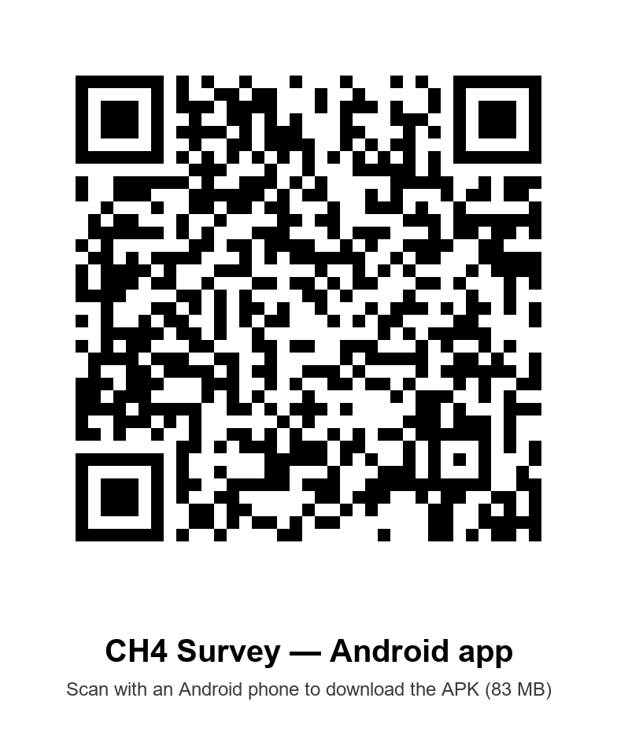

# Atmospheric methane detector

A pocket-sized gas detector you carry on a walk to find methane leaks.

- A small circuit board holds two gas sensors, one for methane and one for LP
  gas (propane and butane).
- The board sends its readings to an app on your phone over Bluetooth.
- The app shows you when the gas level suddenly rises, and saves the readings
  together with your GPS position.
- Afterwards, scripts in this repository turn a recording into a map.

This is a home-built, citizen-science project. It is not a certified safety
device. It shows *where* gas rises; it does not tell you how much gas there is.

<p align="center">
  
  
</p>

## Which version to build

**Build rev C.** It is the current design.

| Version | What it is | Status |
|---|---|---|
| **Rev C** | The current board, 60 × 33 mm. Files are in [hardware/phone_board](hardware/phone_board/). | **Build this one.** This exact board has not been manufactured yet. |
| Rev B | The same circuit on a slightly bigger board (66 × 36 mm). | Built and tested in September 2026. Replaced by rev C. Its files are saved under the git tag [`rev-b`](https://github.com/JamesTwallin/gas_sensor/tree/rev-b/hardware/phone_board). |
| Rev D | An experiment with cheaper sensors. In [hardware/phone_board_mems](hardware/phone_board_mems/). | A draft. Nothing has been built. |
| Rev A | The first prototype, which had its own screen, GPS and memory card. In [legacy/rev_a](legacy/rev_a/). | Retired. |

Rev C and rev B are the same circuit. Rev C is just smaller, with the parts
moved around. So the software and the app work on both, and the tests done on
rev B still count. Running from the battery has not been properly tested yet.

## What you need

| Item | Where to get it | Notes |
|---|---|---|
| The circuit board | Order from [JLCPCB](https://jlcpcb.com/) using the files in [hardware/phone_board/production](hardware/phone_board/production/). | It arrives with almost every part already soldered on. The [board guide](hardware/phone_board/README.md) lists which options to pick when ordering. |
| Methane sensor: Figaro **TGS2611-E00** | [RS Components, stock no. 134-6647](https://uk.rs-online.com/web/p/environmental-sensor-ics/1346647) | You solder this on yourself. It has four legs. |
| LP-gas sensor: Figaro **TGS2610-D00** | RS Components, stock no. 134-6641 (search for it on your country's RS site) | You solder this on yourself too. |
| Battery | [The Pi Hut: 2000mAh 3.7V LiPo Battery, JST-PH connector](https://thepihut.com/products/2000mah-3-7v-lipo-battery), about £10 | **Check the red and black wires before plugging it in**, see below. Any single-cell 3.7 V LiPo battery works if it has a JST-PH plug and built-in protection. |
| USB-C cable | Any | For charging the battery and loading the software. |
| Android phone | | For the app. An iPhone works only if you build the app yourself. |
| Case (optional) | 3D-print it from [hardware/enclosure](hardware/enclosure/) | Also needs four M2 × 8 mm and two M2 × 5 mm self-tapping screws. The case fits the rev B board; one for rev C has not been made yet. |

The two sensors together cost roughly $25–30. Not every electronics shop stocks
them, so use the part names above when searching.

**Battery wires.** Batteries with the same plug are not all wired the same way
round. The battery from The Pi Hut came with red and black swapped compared to
what this board expects, and the two metal pins had to be swapped over in the
plug. A battery plugged in the wrong way round does no damage, but the board
will not switch on. The [board guide](hardware/phone_board/README.md#before-you-power-it)
shows which side is positive.

## Putting it together

1. **Order the board** from JLCPCB.
2. **Solder on the two sensors.** Line up the small tab on each sensor with the
   notch printed on the board.
3. **Load the software onto the board.** Install
   [PlatformIO](https://platformio.org/), plug the board into your computer with
   the USB-C cable, switch the board on, and run these from this folder:

   ```
   pio run -d firmware/phone_board                    # build
   pio run -d firmware/phone_board --target upload    # load it onto the board
   ```

   If your computer cannot find the board: hold the **BOOT** button, tap
   **RESET**, let go of **BOOT**, and try again.
4. **Install the app.** On an Android phone, scan this code, or open the
   [direct link](https://expo.dev/artifacts/eas/GfUwoBCFfugQeaA97EXnztzByZKVXR2_-AvwwxxLo4k.apk)
   on the phone. Your phone will ask for permission to install it.

   

   This is the version built on 2 October 2026. The download is stored by Expo
   and will be removed after a while. If the code has stopped working, or you
   have an iPhone, build the app yourself: see the [app guide](app/README.md).
   The app has a pretend sensor built in, so you can try it before you have a
   board.
5. **Plug in the battery**, after checking the wires (above). Plugging in the
   USB-C cable charges it.
6. **Leave it switched on for about a week**, plugged into a USB charger,
   before trusting it. New sensors need 4 to 7 days of running before their
   readings settle down.
7. **Go for a walk.** Switch the board on, open the app, tap **Connect**, pick
   your board from the list, and tap **Record**.

A quick way to check it works: let a little gas out of an unlit cigarette
lighter near the sensors, for a second or two only. The LP-gas reading should
jump. The methane reading will not, because that sensor has a filter that blocks
lighter gas.

## How it finds gas

The sensors do not give a steady number. Their readings drift up and down with
the temperature, the humidity and the wind, even in clean air. So the app does
not look at how high the reading is. It looks at how fast the reading is
*changing*. Walking into a patch of gas makes the reading shoot up within a
second or two, and the app flags that moment.

For the same reason, the gas concentration the app shows (in parts per million)
is only a rough guide.

More detail, for those who want it:

- [docs/phone_board.md](docs/phone_board.md): how the board is designed and
  how it talks to the phone.
- [docs/sensors.md](docs/sensors.md): how the sensors behave, and what can
  fool them.
- [app/README.md](app/README.md): the app.

## Making a map from a recording

The app saves each walk as a spreadsheet-style file (a CSV). Share it from the
app's **Surveys** tab to your computer and put it in the `tools/data/` folder.
Then, with [Python](https://www.python.org/) installed:

```
pip install -r tools/requirements.txt   # once
python tools/plot_map.py                # makes a map for every recording
python tools/plot_survey.py             # makes a video for every recording
```

- [plot_map.py](tools/plot_map.py) draws your route on a satellite photo,
  coloured by the sensor reading. The maps appear in `tools/maps/`.
- [plot_survey.py](tools/plot_survey.py) makes a video of the readings over
  time. The videos appear in `tools/videos/`.

Recordings contain your GPS positions, so `tools/data/` is never uploaded to
GitHub.

## What is in this repository

```
app/              the phone app
firmware/         the software that runs on the board
hardware/
  phone_board/        the rev C board: design files and the files to order it
  phone_board_mems/   the rev D draft
  enclosure/          the 3D-printed case
docs/             how the board and the sensors work
tools/            scripts that turn recordings into maps and videos
legacy/           old versions, kept for reference
```

## Licence

Firmware is MIT (see [LICENSE](LICENSE)). The hardware design will be released
under CERN-OHL-S once it is ready.
