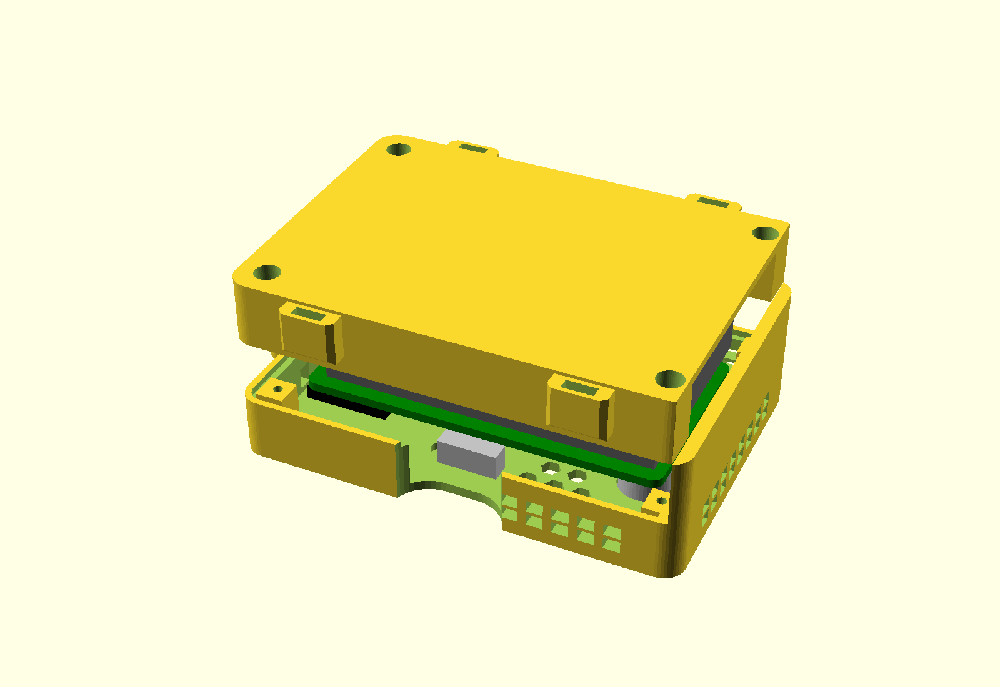

# Handheld enclosure

A two-part printed case for the [phone-companion board](../phone_board/): a
front shell the board screws into, and a back tray that holds the battery.

**Which board it fits.** `case_revb_v2.scad` is sized for the 66 × 36 mm rev B
board, the one that has been built. A case for the 60 × 33 mm rev C board has
not been made yet: the board dimensions and part positions are parameters at
the top of the file (see [If you change the board](#if-you-change-the-board)),
and rev C's positions are already measured out in the older
[legacy/enclosure/case_revc.scad](../../legacy/enclosure/case_revc.scad). The
earlier box-and-lid cases are in [legacy/enclosure](../../legacy/enclosure/).

## The design

The board screws into a **front
shell** with the sensors through its face, and a **back tray** carries the
battery in its own pocket and traps it when screwed on.



- **Case is 81 × 57 mm** (was 51 wide). The cell has to pass between the two
  corner posts at the tray's open end on its way into the compartment, and at
  51 mm wide the gap between them was 36 mm for a 38 mm cell. Now 41.6 mm.
- **Front shell** (81 × 57 × 11.4 mm). Sensor collars and cap holes in the
  face, hex grille around them and at the SHT40 end, RST/BOOT pen holes, LED
  window, engraved lettering. Inside, two 7 mm bosses at the board's H1 and H2
  holes: the board goes in component side first and two M2 × 5 screws through
  the board's back pull it onto them. USB-C and the switch sit in notches open
  to the shell's back edge, so both are reachable with the tray off; the tray's
  rim closes them. Louvres at component level on three sides of the sensor end.
  Four corner posts with pilot holes take the tray screws.
- **Back tray** (78.6 × 57 × 11.8 mm plus a 1 mm lip). A closed compartment
  for the Pi Hut 2000 mAh cell, 60 × 38 × 8 mm: floor, side fences, an end
  fence at the SHT40 end and a 1.2 mm divider plate over the top that keeps the
  cell separate from the board. The compartment is open at the sensor end, a
  full-width slot the cell slides into like a drawer; the divider stops 8 mm
  short of that end so the lead can come up through the gap to the board's
  JST. The front shell's sensor-end wall carries a skirt that reaches down over
  the open end, so with the tray screwed on the slot is closed and the cell is
  captive. Four counterbored corner posts, lip into the shell's rebate on the
  other three sides, zip-tie eyelets on the long walls (the tie passes through them front to
  back). No vents in the
  battery compartment.
- **Orientation**: the board lies component side down in the shell. It goes in
  as if turned over about its long axis, so the sensor end stays at the
  lanyard-free end, the switch is on one long edge and USB-C on the other. Seen
  from the front, the two collars are on the left with CH4 the lower one, the
  switch scallop on the bottom edge, and the SHT40 grille top right.
- **Access with the tray on**: matching 20 mm wide, 5 mm deep scallops cut
  through the face and wall at both the switch and the USB-C socket, on top of
  the side notches (14 × 7.4 mm at the USB-C, 15 × 8 mm at the switch), so a
  thumb reaches the lever and a plug goes in from the front edge.
- **Screws**: 4 × M2 × 8 for the tray, 2 × M2 × 5 for the board. The tray's
  counterbores are 9.3 mm deep, leaving 2.5 mm of plastic under each head, so
  an M2 × 8 puts 5.5 mm of thread into the shell's posts (pilots are 7 mm
  deep). A PH0 or PH00 driver reaches the head down the 4.6 mm bore. The tray
  screws pass through the divider plate at the SHT40-end corners.
- **Second print revision (2026-10-01)**: every corner post is now embedded in a
  solid 5.2 mm block joined to the adjacent walls, in both parts. The first
  print's two tray posts at the open end stood alone on the floor and snapped
  off. The battery compartment has 0.6 mm of play around the cell and 1 mm over
  it (was 0.3 and 0.5, too tight printed). The cell stops 0.6 mm short of the
  corner blocks at the open end, which reach 1.8 mm into its width, so the
  block zone is 5.2 mm of room for the lead, which passes between the two
  blocks. Face lettering: CH4, RST, USB by the port scallop, ON / OFF either
  side of the switch scallop (ON is lever toward the sensor end). The BOOT
  button's pen hole is there but unlabelled.
- **Print**: front face down (collars and lettering on the plate), tray outer
  face down. No supports: the divider is a 39 mm bridge between the side
  fences, which PETG on the A1 handles. Files `stl/revb_v2_front.stl`,
  `stl/revb_v2_back.stl`. Overall assembled depth 22.7 mm.
- **Assembly**: fit the sensors' end of the board under the collars and screw
  the board to the bosses. Slide the cell into the tray's open end, lead first
  is easiest, until it meets the end fence. Bring the lead up through the gap
  at the end of the divider, past the end of the board, and plug it into the
  JST. Screw the tray on: the shell's skirt now covers the open end.
- `-D 'part="section"'` cuts the assembled case in half lengthways for a
  clearance check.

## Files

| File | What |
|---|---|
| `case_revb_v2.scad` | the model, parametric: edit this, not the STLs |
| `stl/revb_v2_front.stl` | front shell |
| `stl/revb_v2_back.stl` | back tray |
| `build/v2_assembly.png` | the render above |

Regenerate after editing (OpenSCAD 2021.01+):

```
openscad -o stl/revb_v2_front.stl -D 'part="front"' case_revb_v2.scad
openscad -o stl/revb_v2_back.stl  -D 'part="back"'  case_revb_v2.scad
openscad -o build/v2_assembly.png --imgsize=1600,1100 -D 'part="assembly"' case_revb_v2.scad
```

`part="assembly"` also draws a mock board, sensors and cell, which is the
quickest way to check a change hasn't broken clearances.

## Printing

- **Material: PETG or ASA.** The heaters put ~0.6 W inside a small box and the
  case sits in sunlight on surveys; PLA creeps and can sag. PETG is the easy pick.
- **0.2 mm layers, 3 walls, 20 % infill.** No supports, no brim needed.
- **Orientation:** front shell face down, back tray outer face down.

## Hardware you need

| Qty | Item |
|---|---|
| 4 | M2 × 8 mm self-tapping screws (tray into the shell's corner posts) |
| 2 | M2 × 5 mm self-tapping screws (board to the bosses at H1 and H2) |
| 1 | 1S LiPo, JST-PH, protected: the compartment is sized for the Pi Hut 2000 mAh cell, 60 × 38 × 8 mm (see the [board README](../phone_board/README.md) for polarity) |

## Known compromises

- **Not weatherproof.** The sensors need open air, so the shell is vented.
- **The sensor cans get hot** (~280 mW each). They protrude by design; don't grip
  them, and give the device a minute of settling after handling before trusting
  a reading.
- **SHT40 accuracy:** the tongue on the board and the grille at that end help, but
  temperature inside any case reads slightly high. Compare against a reference
  thermometer before trusting absolute temperature.

## If you change the board

`case_revb_v2.scad` carries the board dimensions and part positions at the top
(all in KiCad board coordinates, origin at the board's top-left corner). Update
them there and re-export. Set `board_t = 1.0` if you order 1 mm boards.
