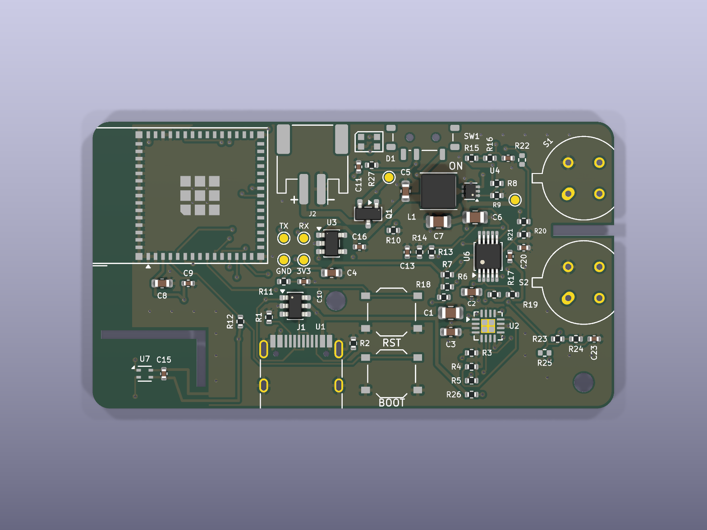

# Phone-companion board (rev C)

A 60 × 33 mm, 4-layer board: bare ESP32-S3-MINI-1, two bare Figaro TGS sensors,
ADS1115, SHT40 temp/humidity, LiPo charging and a 5 V heater boost. Position, display,
storage and signal processing live on the phone. The electrical spec (why each
part, pin map, BLE protocol) is [docs/phone_board.md](../../docs/phone_board.md).



**Status: rev C is rev B compacted, not yet fabricated.** Rev B (66 × 36 mm) was
fabricated and assembled at JLCPCB and passed bring-up on 2026-09-28: it
enumerates over native USB, flashes, and `firmware/phone_board` reports the
ADS1115, the SHT40, a 5.02 V heater rail and both Figaro sensors on USB power.
BLE and battery operation are not yet exercised.

Rev C keeps rev B's schematic and parts, shrinks the board from 66 × 36 to
60 × 33 mm (17 % less area) and gives it a business end:

- **Front (right) edge: the sensors.** Both Figaro cans overhang the edge by
  about 1 mm and a 7 mm notch is milled between them, so each can stands in air
  on three sides and the two heaters share less board.
- **Rear: the power connections, beside the ESP32.** USB-C on the bottom edge
  and the battery JST-PH on the top edge, both right next to the module and
  about 30 mm from the heaters; the reverse-cell FET sits by the JST.
- **SHT40 isolation.** The tongue keeps its L-slot with a 2.5 mm neck, and no
  copper pour is allowed on any of the four layers over the tongue or neck:
  only its four tracks cross, since copper is what carries board heat.
- The hand-routed boost loop and ESP32 decoupling were moved as rigid units;
  everything else was re-placed (charger and ADC in the middle, RESET above
  BOOT, serial test pads as a labelled 2 × 2 grid).

The KiCad checks report 0 DRC violations, 0 unconnected items and 0
schematic/PCB mismatches; ERC is clean.

**USB-only power is marginal at heater turn-on.** With no cell on J2, the
BQ24073's 500 mA USB input limit only just covers the boost converter starting
into two cold heaters: an early firmware that enabled the heaters 3 s after
boot, with BLE advertising and the CPU at 240 MHz, browned out the ESP32 at
that instant on two consecutive boots. The firmware now enables the heaters as
the very first thing in `setup()` at 80 MHz, before any other load, and a cold
start then survives. A LiPo on J2 removes the margin problem, since the cell
holds VSYS up through the inrush. If a future revision is made, raise the
charger's input limit (ILIM mode) or add bulk capacitance on VSYS.

## The design is generated — edit `gen/design.py`, not the KiCad files

`gen/design.py` holds every part, net, LCSC number, placement, pre-routed
track and rule. The scripts turn it into the KiCad project:

| Step | Command | Output |
|---|---|---|
| custom symbols | `python gen/build_lib.py` | `lib/phone_board.kicad_sym` (TPS61023, TGS26xx) |
| schematic | `python gen/build_sch.py` | `phone_board.kicad_sch` (net-label style) |
| board (placed, unrouted) | `"C:\Program Files\KiCad\9.0\bin\python.exe" gen/build_pcb.py` | `phone_board.kicad_pcb`, `.kicad_pro` rules |
| autoroute | `...\python.exe gen/route.py` | routed board, GND pours + stitching vias |
| tidy silkscreen labels | `...\python.exe gen/tidy_silk.py` | moves/hides overlapping reference designators on the routed board |
| JLC placement | `...\python.exe gen/jlc_align.py` (needs `pip install easyeda2kicad`) | `gen/jlc_placement.json` |
| fab files + renders | `python gen/export.py` | `production/`, `preview/` |
| relabel silkscreen only | `...\python.exe gen/build_pcb.py --silk-only` | edits the routed board in place |

Then check: `kicad-cli pcb drc --schematic-parity phone_board.kicad_pcb` and
`kicad-cli sch erc phone_board.kicad_sch`.

**Rebuilding the board throws away the routing.** `build_pcb.py` then needs a
fresh `route.py` run of about 5 minutes. Freerouting doesn't route exactly the
same way twice, so re-run DRC afterwards.

`route.py` needs Freerouting 2.4+ and Java 25+ (a portable JRE is fine):

```
set JAVA=C:\path\to\jdk-25-jre\bin\java.exe
set FREEROUTING=C:\path\to\freerouting-2.4.1.jar
```

How routing works:

- **The boost converter's power loop is routed by hand.** This covers the
  inductor to SW, the output caps, the feedback sense point and the GND vias,
  and it lives in `PREROUTE`. The tracks are locked, so Freerouting routes
  around them.
- **In1 is a solid GND plane.** The script marks it as a power layer, so no
  signals are routed on it.
- **F.Cu, In2 and B.Cu carry signals**, then get GND pours.
- **The script runs Freerouting up to 3 rounds**, then adds GND stitching vias
  and a via for any pour island that has none.

You can also open `phone_board.kicad_pro` in KiCad and edit by hand. Just
don't regenerate over those edits.

## Ordering from JLCPCB

1. **PCB:** upload `production/gerbers.zip`. Choose 4 layers, 1.6 mm, and the
   JLC04161H-7628 stackup (or any).
   - **Minimums used:** 0.2 mm track/clearance (0.15 mm at the SOT-563), 0.3 mm
     vias, and 0.2 mm drill for the via-in-pad GND vias under the ESP32 and the
     charger.
   - **Via-in-pad:** choose "Epoxy filled & capped" if the price is acceptable;
     otherwise untented plain vias will do for a prototype.
2. **Assembly:** choose the top side, then upload `production/bom.csv` and
   `production/cpl.csv`.
   - **The CPL is already corrected for JLC's library.** `gen/jlc_align.py`
     downloads LCSC's footprint for every assembled part and pad-matches it
     against the board to get JLC's origin and rotation. That found a 2.55 mm
     origin shift on the ESP32, 1.5 mm on the USB-C, and 90°/180°/270°
     rotation differences on U1, U3, U4, U6 and U7. Still look over the
     preview, especially the pin-1 dots on the ICs.
   - **Extended parts:** most ICs are "extended", so expect a per-part loading
     fee.
3. **Solder these yourself:**
   - **Figaro TGS2611-E00 (S1, CH4) and TGS2610-D00 (S2, LPG).** Neither is
     stocked at LCSC; buy from Digi-Key or Mouser. They are through-hole, so
     line the tab up with the silkscreen notch.
   - **Figaro recommends a long burn-in before the readings settle**: 7 days
     (TGS2611) / 4–7 days (TGS2610) with the heater on.

## Before you power it

- **Battery polarity.** J2 (JST-PH) is wired pin 1 = −, pin 2 = +. On the
  fabricated rev B boards that puts **positive (red) on the pin nearer the
  sensor end** of the board. The Pi Hut "2000mAh 3.7V LiPo Battery - JST-PH
  Connector" arrived the other way round and needed its two crimps swapped in
  the plug (2026-09-30); check any cell against this before plugging in. Q1
  blocks a reversed cell (nothing gets damaged, it just won't power). Use a
  cell **with a built-in protection circuit**; the board has no deep-discharge
  cutoff. A future revision could replace Q1 with a four-MOSFET bridge to make
  the input polarity-agnostic.
- **The power switch** (SW1) switches the regulator enables, not the battery.
  The battery still charges when it's off.
- **First bring-up:**
  1. Check +3V3 on TP4 with no sensors fitted. +5V_HTR (TP6) stays at 0 V until
     firmware drives GPIO7 high; heaters are firmware-controlled.
  2. Flash `firmware/phone_board` over USB-C. If it doesn't enumerate, hold
     BOOT and tap RESET.
- **3D models:** the renders show no models for the ESP32 module, USB-C, the
  switches or the sensors, because KiCad doesn't ship them. This is cosmetic.

## Cutting the cost

Rev C's smaller outline barely moves the JLCPCB price at 5 pieces (the 4-layer
bare-board price is close to flat below 100 × 100 mm). The levers that do
matter, biggest first:

- **Extended-part loading fees.** JLC charges a loading fee per Extended part
  type on top of the part price. The ESP32 module, BQ24073, TPS61023, ADS1115,
  SHT40, WS2812B-2020, the MSK12C02 slide switch and the JST-PH are all
  Extended; check the rest against the JLC library and swap any Extended
  resistor/capacitor value for a Basic neighbour (the 732 kΩ feedback resistor
  is the likely one; a 750 kΩ Basic part shifts the heater rail by ~2 %).
- **Two layers instead of four.** The bare board then costs roughly a third
  as much at low quantity. Electrically feasible (USB full-speed, I2C and a 1 MHz boost
  are the fastest things here) but it is a full re-route with the bottom
  side as ground, not a tweak of this layout.
- **Cheaper silicon.** ADS1015 is pin- and register-compatible with ADS1115 at
  12 bits instead of 16 and about half the price; the firmware's gain and
  scaling would need checking. SHT30 is cheaper than SHT40 but has a different
  footprint and driver.
- **Skip via-in-pad filling.** Plain vias under the ESP32 and charger are fine
  for prototypes and avoid the filled-and-capped surcharge.
- **Quantity.** The setup, stencil and loading fees are per order, so 10 boards
  cost little more than 5.

## Known limitations of rev B and rev C

- **Charger:** BQ24073 (no SYSOFF pin). In the off position < 10 µA still flow
  from the battery.
- **Charge current** is fixed at ~500 mA, and input current is limited to USB500.
- **Heater warmth:** the SHT40 sits on a slotted tongue away from the heaters,
  but the board as a whole will still warm up. Compare against a reference
  thermometer before trusting `temp_c`.
- **Schematic layout:** the generated schematic uses net labels, not drawn
  wires. Connectivity is exact, but it's less readable than a hand-drawn one.
- **ESP32 ADC fallback:** R22/R25 are not fitted. Hand-fit 1 kΩ 0402 parts only if the
  ADS1115 needs bypassing.
