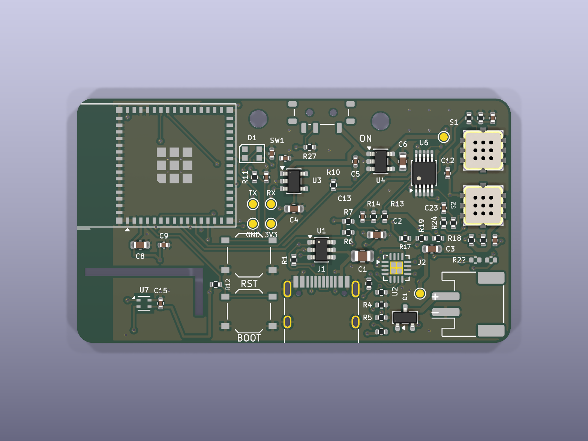

# Phone-companion board, MEMS sensors (rev D draft)

A 55 × 31 mm, 4-layer board: the rev C phone-companion board with its two
Figaro TO-5 cans replaced by **Winsen GM-402B MEMS sensors** and the 5 V heater
boost replaced by a **2.8 V LDO**. Everything else is the rev C circuit: bare
ESP32-S3-MINI-1, BQ24073 charger, USB-C, ADS1115, SHT40 on a slotted tongue.
The electrical spec is [docs/phone_board.md](../../docs/phone_board.md); the
rev C board it descends from is [hardware/phone_board](../phone_board/).

**Status: draft, generated and checked, not ordered.** DRC, connectivity,
schematic parity and ERC are clean. Nothing has been built, and the GM-402B
has not been characterised on the bench: treat the load resistor value and the
firmware constants below as starting points.

## Why

| | rev C (Figaro TGS2611 + TGS2610) | rev D (2 × GM-402B) |
|---|---|---|
| Sensor cost | ~$25–30 for the pair, hand-soldered | ~$5–8 for the pair, JLC-placed |
| Heater | 5 V, ~56 mA each, 0.56 W total, boost converter + inductor | 2.8 V, ~35 mA each, 0.2 W total, one SOT-23-5 LDO |
| USB-only operation | marginal at heater turn-on (500 mA USB limit) | comfortable |
| Battery life | heaters are most of the load | roughly double |
| Board | 60 × 33 mm | 55 × 31 mm |
| Selectivity | two different sensors (CH4 vs LPG) | two identical sensors (see below) |
| Track record | proven on the rev B build | none yet |

## What changed from rev C

- **Sensors.** GM-402B, LCSC C99754, Extended part, SMD-8 5 × 5 mm. Pads 1/3
  are the heater (2.8 V ± 0.1 V across ~80 Ω, ≤ 80 mW), pads 5/7 the sensing
  electrode, the rest no-connect. The footprint and 3D model come from LCSC via
  easyeda2kicad (`lib/phone_board_mems.pretty`, `lib/phone_board_mems.3dshapes`).
- **Heater rail.** `+2V8_HTR` from a Microne ME6211C28M5G-N (LCSC C53099,
  SOT-23-5, enable pin). Enable is `HTR_EN` with the same 100 k pull-down, so
  the firmware's heater switching, low-battery cutoff and fail-safe are
  unchanged. TP6 is on this rail.
- **Electrode loop.** The sensing side runs from +3V3 through the element into
  a 10 k + 10 k load (RL = 20 k, tap = VRL/2 ≤ 1.65 V). Same topology as rev C
  with VC = 3.3 V instead of 5 V and RL halved. The GM-402B is 1–30 kΩ in
  5000 ppm CH4 and at least 2 × that in clean air; 20 k is a middle-of-range
  choice to be tuned once a real part has been measured.
- **Heater monitor.** R15/R16 divide `+2V8_HTR` to 1.4 V at the ADS1115 (was 2.5 V).
- **Gone.** TPS61023, the 1 µH inductor, its 22 µF output caps and feedback
  divider, the hand-routed boost loop, the sensor silkscreen circles.
- **Layout.** MCU column and SHT40 tongue as rev C (tongue shortened for the
  31 mm board, its neck re-routed by hand); USB/charger column moved up 2 mm
  into the room the boost left; ADC where the inductor was; sensors as a
  right-hand column rotated so their electrode pads face the ADC; JST-PH under
  them leaving through the right edge. Both mounting holes are on the top edge
  (there is no room at the bottom-right any more): revisit before designing an
  enclosure.

## Two identical sensors

The rev B/C concept used two different Figaro parts (methane vs LP-gas) for
source discrimination. The GM-402B responds to both CH4 and C3H8, so rev D
fits **two of the same sensor**: channel 2 (still called `LPG` in the firmware,
app and CSV so nothing downstream breaks) becomes a second methane channel,
useful for redundancy and noise checks rather than discrimination. Winsen's
other GM-series parts (GM-502B VOC, GM-702B CO) share the package but not
necessarily the 2.8 V heater spec, so check before fitting one in S2.

## Firmware and app changes needed

None of this is done yet. In `firmware/phone_board/src/main.cpp`:

- `RL_OHM` 40000 → 20000, and `vc_mv` in the info JSON 5000 → 3300.
- `HEATER_MIN_MV`/`HEATER_MAX_MV` 4800/5200 → about 2700/2900; `heater_mv` is
  now the LDO output, and the ADS1115 tap reads 1.4 V nominal.
- `board` in the info JSON: `"rev-d-mems"`.
- The heaters-first-at-80 MHz boot ordering can stay, but it is no longer
  needed: the LDO's 70 mA is well inside the USB500 limit.
- Winsen quotes a burn-in before readings settle; keep the rolling-baseline
  approach, and expect the `rl_ohm`/`tap_ratio` scaling in the app to give
  different absolute `*_vout_mv` values than the Figaro boards.

## The design is generated — edit `gen/design.py`, not the KiCad files

Same toolchain as rev C, same commands, run from this directory:

| Step | Command |
|---|---|
| custom symbols | `python gen/build_lib.py` (GM-402B, ME6211C28) |
| schematic | `python gen/build_sch.py` |
| board (placed, unrouted) | `"C:\Program Files\KiCad\9.0\bin\python.exe" gen/build_pcb.py` |
| autoroute | `...\python.exe gen/route.py` (needs `JAVA` and `FREEROUTING`, see the rev C README) |
| tidy silkscreen | `...\python.exe gen/tidy_silk.py` |
| JLC placement | `...\python.exe gen/jlc_align.py` (needs `easyeda2kicad`) |
| fab files + renders | `python gen/export.py` |

Then `kicad-cli pcb drc --schematic-parity phone_board_mems.kicad_pcb` and
`kicad-cli sch erc phone_board_mems.kicad_sch`.

## Ordering

As for rev C (4 layers, top-side assembly, `production/gerbers.zip`,
`bom.csv`, `cpl.csv`), except that **nothing needs hand soldering**: the
GM-402B is placed by JLC. It is MSL 3, which JLC handles. The BOM has one fewer
Extended part than rev C (the boost is gone, the LDO and the sensor are both
Extended). The GM-402B has an open mesh cap: do not let the pick-and-place or
the enclosure press on it, and keep conformal coating off it.

## Known unknowns

- **GM-402B behaviour** on this circuit (RL, warm-up, humidity drift) is
  untested. The heater spec is from Winsen's product page; the manual PDF is
  image-only and could not be machine-read, so check the pinout against the
  printed manual before ordering.
- **ME6211 pinout** (1 VIN, 2 GND, 3 CE, 4 NC, 5 VOUT) is taken from LCSC's
  symbol, which matches the AP2112K order. Verify against the datasheet.
- **Enclosure.** `hardware/enclosure` fits the rev B board; nothing has been
  adapted for this outline.
