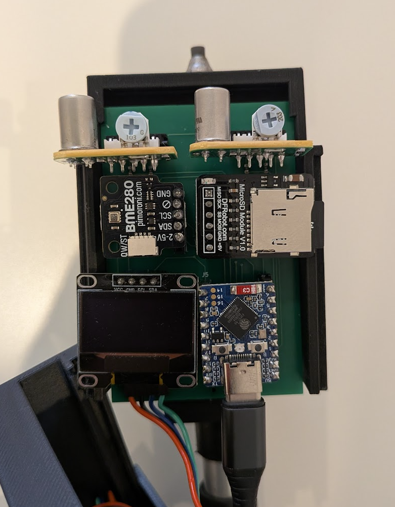
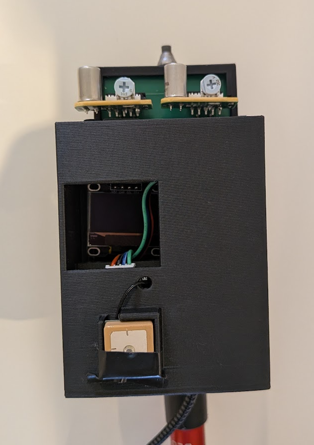

# Rev A prototype (retired)

> This is the first prototype, kept for reference. The current design is the
> rev C board and phone app: see the [top-level README](../../README.md).

A self-contained logger: two Figaro sensor modules, a GNSS receiver and a BME280
on a carrier board, logging a geotagged CSV to a microSD card and showing a
status screen on an OLED. The firmware logs exactly what the hardware reported,
uncorrected.

<p align="center">
  
  
</p>

## What is here

```
platformio.ini    build configuration, board, flags, pinned libraries
src/main.cpp      firmware (design notes in its header comment)
schematic.md      connection spec: every pin, net and rail
carrier_board/    KiCad 9 project
images/           photos of the built prototype
```

## Status

The firmware works: it reads both gas channels, the OLED, the GNSS and the
BME280, runs a rolling-percentile baseline and a HIGH/MED/LOW classifier, drives
the onboard RGB status LED, and logs one geotagged row per sample to microSD (and
serial). The BOOT button re-zeros the baseline. NVS storage and a dedicated mark
button were never done. The full design notes are in the header comment of
[src/main.cpp](src/main.cpp).

**Known limitation:** the DFRobot GNSS library (I2C mode) gives satellite count,
position, altitude and UTC, but **not** HDOP or fix type, so the firmware derives
a coarse FIX / NO-FIX from satellite count and plausible coordinates. Real fix
quality would need the module's UART NMEA stream.

## Hardware

Target board: **Waveshare ESP32-S3-Zero** (ESP32-S3FH4R2 — 4 MB flash, 2 MB
PSRAM, native USB). It has no official PlatformIO definition, so the build uses
`esp32-s3-devkitc-1` with flash pinned to 4 MB.

| Peripheral | Part | Interface | Power |
|---|---|---|---|
| OLED display | SSD1306 128x64 | I2C (0x3C) | 3V3 |
| Methane sensor | Figaro NGM2611-E13 | analog VOUT → ADC | 5V |
| LP-gas sensor | Figaro LPM2610-D09 | analog VOUT → ADC | 5V |
| GNSS | DFRobot Gravity (Quectel L76K) | I2C (0x20) | 3V3 |
| Environment | Bosch BME280 | I2C (0x76) | 3V3 |
| microSD card | Fermion microSD module | SPI | 3V3 |
| Status LED | onboard WS2812 RGB | onboard GPIO | onboard |
| Re-zero button | onboard BOOT | onboard GPIO | — |

### Pin map

Every GPIO the firmware uses, from [src/main.cpp](src/main.cpp):

| GPIO | Function | Connected to | Notes |
|---|---|---|---|
| 0 | BOOT button | onboard BOOT | re-zeros the baseline; also the ROM-bootloader strap |
| 1 | CH4 analog in (ADC1) | NGM2611 VOUT | via 10k/10k divider; `ADC_11db`, 12-bit |
| 2 | LPG analog in (ADC1) | LPM2610 VOUT | via 10k/10k divider; `ADC_11db`, 12-bit |
| 6 | I2C SDA | OLED + GNSS (D/T) + BME280 | shared bus, 100 kHz |
| 7 | I2C SCL | OLED + GNSS (C/R) + BME280 | shared bus, 100 kHz |
| 10 | SPI CS | microSD CS | microSD has its own SPI bus |
| 11 | SPI MOSI | microSD MOSI | |
| 12 | SPI SCK | microSD SCK | |
| 13 | SPI MISO | microSD MISO | |
| 19 / 20 | USB D− / D+ | native USB | serial + flashing — do not reuse |
| 21 | WS2812 data | onboard RGB LED | board is red-first, so the firmware swaps R/G |

Power: the Figaro modules (and their heaters) run from **5V**; the OLED, GNSS and
microSD run from **3V3**; common ground throughout. Free GPIOs for expansion:
4, 5, 8, 9, 14–18.

> **Voltage warning.** Each Figaro VOUT can reach ~4.95 V — above the ESP32-S3's
> 3.3 V limit — so each VOUT **must** go through a 10k/10k divider (~2.5 V at the
> factory alarm level). The firmware applies `VOUT_DIVIDER_RATIO = 2.0` to recover
> the real VOUT and warns on serial if a pin reads near its ceiling, which means a
> divider is missing or open.

Per-sensor wiring notes (addresses, the GNSS dual-labelled pads, the BME280-vs-BMP280
check, microSD logging behaviour) are in [schematic.md](schematic.md) and the
[src/main.cpp](src/main.cpp) header. Humidity matters because it is the main
uncorrected confounder for these MOX sensors — see
[docs/sensors.md](../../docs/sensors.md).

## Building and flashing

From the repository root, with [PlatformIO](https://platformio.org/) installed:

1. Build: `pio run -d legacy/rev_a`
2. Flash over USB: `pio run -d legacy/rev_a --target upload`. If the board isn't
   found, enter the ROM bootloader by hand: hold **BOOT**, tap **RESET**, release
   **BOOT**, retry.
3. Watch output: `pio device monitor -d legacy/rev_a` — you'll see the banner, then ~4 CSV rows/s
   once it reaches RUNNING.

## CSV format

Both the serial stream and the microSD log use one row per sample:

```
millis_since_boot, state, ch4_vout_mv, ch4_baseline_mv, ch4_dev_mv,
lpg_vout_mv, lpg_baseline_mv, lpg_dev_mv,
temp_c, humidity_pct, pressure_hpa,
utc_iso8601, lat, lon, alt_m, sats, fix
```

- Per channel: conditioned VOUT (mV), the rolling clean-air baseline, and their
  difference (`*_dev_mv`, the anomaly). `state` is `WARMUP` / `BASELINING` / `RUNNING`.
- `temp_c` / `humidity_pct` / `pressure_hpa`: the BME280 reading, blank if none
  is fitted. `humidity_pct` is the one that matters for rejecting MOX false positives.
- `utc_iso8601` is `YYYY-MM-DD HH:MM:SS.mmm` (whole second from the GNSS, ms
  interpolated from the on-board clock); blank until the GNSS has time.
- `lat` / `lon` / `alt_m` are only meaningful when `fix` is 1, and are blank
  otherwise so a parser can tell a real 0 from a missing value.

Blank fields throughout mean "not measured", distinct from a real 0. The phone
app writes the same columns first and appends its own, so the scripts in
[tools/](../../tools/) read both.

## Carrier board

The carrier board replaces the breadboard: the ESP32-S3-Zero and every sensor
plug into 2.54 mm header sockets, and the only soldered parts are the two 10k/10k
VOUT dividers (R1–R4). [schematic.md](schematic.md) is the connection spec (every
pin, net and rail).

The KiCad 9 project is in [carrier_board/](carrier_board/). It uses generic
library parts — each module is a header socket, and the ESP32-S3-Zero is modelled
as its two 9-pin headers (a pair of `Conn_01x09`) rather than a custom symbol.
The schematic is captured and the two-layer board is **placed and routed** (with
a ground pour), with [Fabrication Toolkit](https://github.com/bennymeg/Fabrication-Toolkit)
options set for gerber export. A Waveshare ESP32-S3-Zero symbol is vendored under
[carrier_board/lib/](carrier_board/lib/) (from
[jtomka/kicad-esp32-s3-zero](https://github.com/jtomka/kicad-esp32-s3-zero)) but
is not currently used. Treat it as untested — routed and ready for fab, not
validated in hardware.
